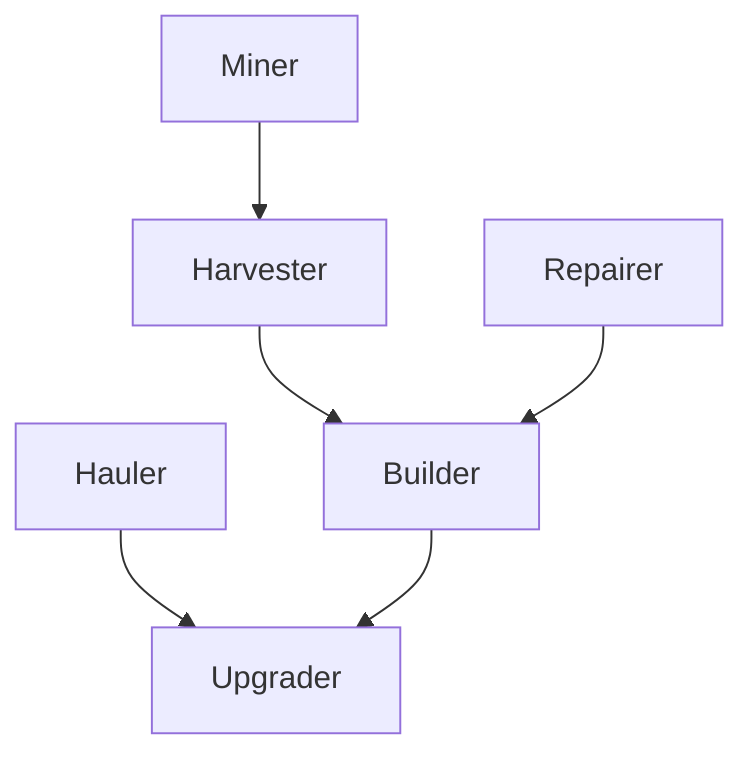

# screeps

Embarassing screeps code; probably don't look at this

## Roles

The `Role` class enables adding fallback behavior if a role cannot be performed



All of the roles take energy from the nearest container, and fall back on harvesting energy
themselves if there's no energy available in a container.

* `MinerRole` - A static miner that is assigned to a specific source with a nearby container

  Falls back on `HarvesterRole` if assigning the miner to a source failed
* `HaulerRole` - Provides energy from containers to spawns, containers, extensions, and room storage

  Upgrades the controller if there's nothing to haul
* `HarvesterRole` - A `HaulerRole` that doesn't take energy from containers, preferring to mine it
  instead. This is a failsafe role, that enables bootstrapping from a low-energy state.

  Falls back on `BuilderRole` if there's no need for hauling
* `BuilderRole` - Builds any available construction sites

  Falls back on `UpgraderRole` if there's nothing to build
* `RepairerRole` - Repairs any damaged structures

  Falls back on `BuilderRole` if there's nothing to repair
* `UpgraderRole` - Upgrades the room controller. Has no fallback, and is intended to be the fallback
  of most roles.

## Vim ALE LSP configuration

```sh
npm install -g typescript-language-server typescript
npm install @types/screeps
npm install @types/lodash
```

## TODO list

* [x] Add `Role` class heirarchy, to enable code-sharing between roles, which in turn enables
      fallback `Role`s.
* [x] IDE integration
  * [x] tsserver
  * [x] prettier
  * [x] eslint
* [x] Add `Tower` behavior for repair and defense
* [x] Upgrading is too slow. Fallback roles aren't quite right
* [ ] Need manager / logistics coordinator
* [x] `.energy` and `.energyCapacity` are deprecated in favor of `.store`
* [X] Make creep components dependent on energy availability (maybe max energy availability?)
* [X] Move creep spawning logic into `Role`s?
* [X] Add up to 5 `WORK` components to `MinerRole`s based on energy availability
* [ ] Long-distance harvesting
* [ ] Expand to other rooms
